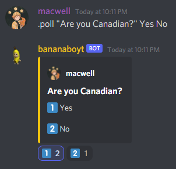

<!-- PROJECT LOGO -->
<br />
<div align="center">
  <a href="https://github.com/github_username/repo_name">
    
  </a>
  
<h3 align="center">bananaboyt</h3>

  <p align="center">
    A general purpose Discord bot
  </p>
</div>


<!-- ABOUT THE PROJECT -->
## About The Project

There are many great general purpose discord bots already avaliable online; however, I didn't find one that fitted my needs of being simple and also containing a leveling system.
This project is intended to be used as a generic private discord server bot. 
It includes a leveling system in which xp and levels are gained by being active in a discord server, and it also contains quality of life commands such as creating a poll and accessing the icon of a user.


### Built With

* [discord.py](https://discordpy.readthedocs.io/en/stable/)


<!-- GETTING STARTED -->
## Getting Started

### Prerequisites

Verify all requirements from `requirements.txt` are installed. 

### Installation


1. Clone the repo
   ```sh
   git clone https://github.com/Maxarino/bananaboyt.git
   ```
   
2. Enter your Discord bot token in `hiddentoken.py`
   ```py
   token = 'ENTER YOUR TOKEN'
   ```
   
3. Run the bot
   ```sh
   py bananaboyt.py
   ```
   
Default command prefix: `.`


<!-- USAGE EXAMPLES -->
## Usage

* `poll <args>` : creates a poll with up to 5 options
  * An example of a proper use of the command is: 
    <br/> 
    
    
* `leaderboard` : displays server chat leaderboard
* `level <member>` : displays the current level of `<member>`
* `xp <member>` : displays the amount of xp points `<member>` has acquired
* `avatar <member>` : returns the avatar of `<member>`
* `id <member>` : returns the discord id of `<member>`
* `coinflip` : flips a coin
* `help` : displays all commands and what they do / how to use them

